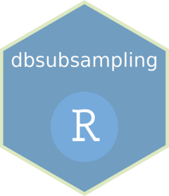

<!-- README.md is generated from README.Rmd. Please edit that file -->

# dbsubsampling <a href="https://jieyinstat.github.io/dbsubsampling/"></a>

<!-- badges: start -->

[](https://github.com/JieYinStat/dbsubsampling/actions/workflows/R-CMD-check.yaml)
<!-- badges: end -->

Providing a unified interface for IBOSS, Lowcon, OSS and other popular
design-based subsampling methods.

## Installation

You can install the development version of dbsubsampling from
[GitHub](https://github.com/) with:

``` r
# install.packages("devtools")
devtools::install_github("JieYinStat/dbsubsampling")
```

## Example

This is a basic example which shows you how to get subsample index, such
as uniform sampling, OSMAC, IBOSS, OSS, LowCon and IES:

``` r
library(dbsubsampling)

data_binary <- data_binary_class

# Uniform sampling
subsampling(y_name = "y", data = data_binary, n = 10, method = "Unif", seed = 123)
#>  [1] 2463 2511 8718 2986 1842 9334 3371 4761 6746 9819

# OSMAC-A
subsampling(y_name = "y", data = data_binary, n = 10, pilot_n = 100, method = "OSMAC_A", 
            seed_1 = 123, seed_2 = 456)
#>  [1] 5684 1620 5372 8297 8863 9783 6483 6103 2702 5735

# OSMAC-L
subsampling(y_name = "y", data = data_binary, n = 10, pilot_n = 100, method = "OSMAC_L",
            seed_1 = 123, seed_2 = 456)
#>  [1] 5813 1681 5372 8313 8863 9780 1630 6103 2702 5888

# IBOSS
data_numeric <- data_numeric_regression
subsampling(y_name = "y", data = data_numeric, n = 100, method = "IBOSS")
#>  [1]  183  226  395  419  584  666  711  758 1027 1144 1324 1445 1940 1946 1978
#> [16] 2018 2673 2982 3190 3395 3484 3612 3632 3638 3696 3816 3835 3896 3921 4256
#> [31] 4312 4405 4523 4551 4729 4938 5121 5226 5342 5410 5679 5770 5995 6089 6163
#> [46] 6170 6203 6250 6525 6964 6979 7053 7198 7407 7564 7633 7915 7935 7967 7992
#> [61] 8026 8088 8106 8156 8161 8267 8306 8501 8503 8521 8534 8694 8805 8841 9117
#> [76] 9211 9302 9364 9398 9456 9676 9946 9971 9989 1173 2344 5394 8438 8567 9239
#> [91] 1787 2104 2215 3121 7159 9133

# OSS
subsampling(y_name = "y", data = data_numeric, n = 30, method = "OSS")
#>  [1] 8841 8961 1902 7512   48 9867 6547 9784 3392 3622 5780 6594 1890 1850 8335
#> [16] 1254 6204 1257 4611 3831 4782 4919 1579 3404  718 7189 2060 4899  590 1800

# LowCon
subsampling(y_name = "y", data = data_numeric, n = 10, method = "LowCon", seed = 123, theta = 1)
#>  [1] 6032 6633 4180 5093 6005 7093 3621 4429 1715 7143

# IES
subsampling(y_name = "y", data = data_numeric, n = 10, method = "IES", seed = 123, q = 16)
#>  [1] 2876 7890 4440 9400 9813 2499 4939 8165 2224 4628
```

You can get more detailed examples from the article column on the
[website](https://jieyinstat.github.io/dbsubsampling/).
